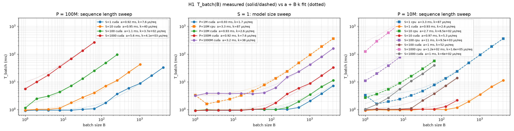
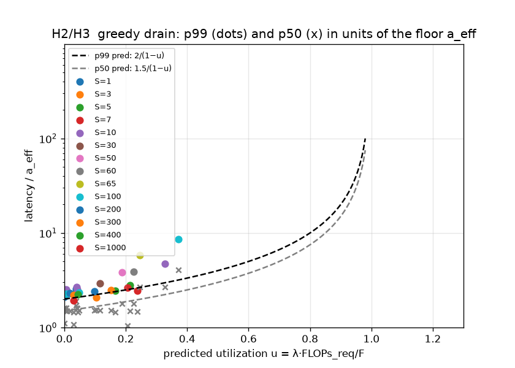
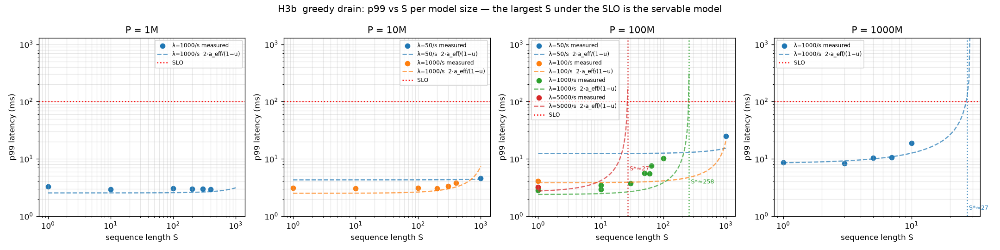
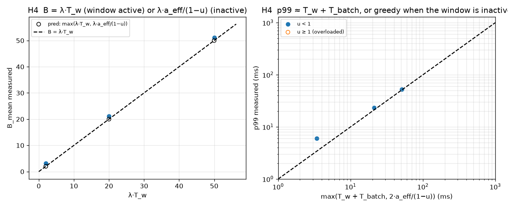
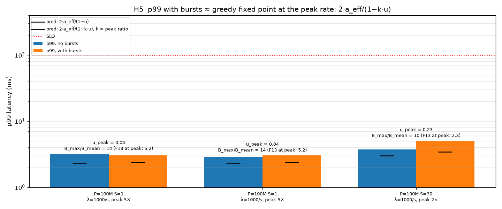

# Batching + GPU 102: Measuring the Formulas

*Companion to [Batching + GPU 101](./Batching_GPU_101.docx). Code, design notes and raw results: `server.py`, `client.py`, `sweep.sh`, `plot.py`, `benchmark_design.md`, `tracker.csv` in this folder.*

Part 1 claimed that a handful of formulas — per-batch time `T_batch(B) ≈ a + k·B`, utilization `u = λ·k`, and the greedy-drain fixed point `p99 ≈ 2·a_eff/(1 − u)` — are enough to size a GPU serving fleet. This post checks them with a small client–server benchmark on an RTX 3070 (fp16) and a 4-thread CPU, across four decades of model size (1M–1B parameters), sequence lengths 1–1000, arrival rates 50–5000 requests/s, two batching policies, and bursty traffic. All numbers below are read from the five figures; nothing is fitted except the two calibration constants `a` and `k`, which the server measures at startup.

## Setup in one paragraph

The **client** sends open-loop Poisson traffic at λ requests/s for 120 s (10 s warm-up excluded), stamps each request with its *scheduled* send time, and records p50/p99 of the end-to-end latency. A request is 4 bytes (an id); the **server** derives a fixed-length token sequence from the id, batches requests, runs one forward pass per batch through a 4-layer transformer encoder of P parameters, and returns 12 bytes (id, score, checksum of the scored row). Zero checksum mismatches in every run — the batcher never scrambles rows. Batching policy is **greedy drain** (run whatever queued during the previous pass) unless a window `T_w` is set. At startup the server times one forward pass at every power-of-two batch size; that table gives `a = T_batch(1)` and `k` = slope at large B, and everything predicted below uses only those two numbers plus λ. Loopback TCP, no JSON, no feature fetch: the benchmark isolates the batcher and the GPU. Full assumptions in `benchmark_design.md`.

## H1 — The roofline: `T_batch(B) ≈ a + k·B`



*Solid: measured per-batch time from the calibration sweep. Dotted: `a + k·B` with `a` and `k` from the same table (values in the legend). Left: 100M model across sequence lengths. Middle: S = 1 across model sizes, CPU dashed. Right: 10M model across sequence lengths, CPU dashed.*

- **The floor does not depend on model size.** At S = 1, `a` = 0.93 / 0.93 / 0.92 ms for 1M / 10M / 100M. The forward pass is bound by ~60 kernel launches, not by FLOPs or weight reads, until the 1B model (a = 3.2 ms, where the 2 GB weight read finally shows).
- **The free-batching region shrinks with S.** For 100M the curve is flat to B ≈ 120 at S = 1, to ≈ 8 at S = 10, and is linear from B = 1 at S ≥ 100. A sequence of S tokens is already a batch of S rows for the weight matrices; long inputs leave nothing to amortize across requests.
- **k scales with P·S, F with model width.** Slopes: 7.6 µs/request (100M, S = 1) → 40 (S = 10) → 370 (S = 100) → 4100 (S = 1000). The implied rate F = FLOPs_req/k is 26 TFLOP/s for 100M and 53 for 1B, but only 7.7 for 10M and ~1 for 1M: narrow matmuls cannot fill the card at any batch size.
- **CPU (4 threads, fp32).** Similar floor at S = 1 (3.3 ms), but k is 33× the GPU's at S = 1 and 270× at S = 1000, and its floor grows with S (3 → 120 ms) while the GPU's barely moves (1 → 5.6 ms). Batching helps the CPU until B ≈ 8, then it is compute-bound at ~0.25 TFLOP/s.

## H2/H3 — One curve for everything: `p99 ≈ 2·a_eff/(1 − u)`



*Every greedy-drain run on the GPU (14 sequence lengths, 4 model sizes, λ from 50 to 5000/s), plotted as p99 (dots) and p50 (×) in units of the server's floor `a_eff`, against predicted utilization `u = λ·k`. Dashed: `2/(1 − u)` and `1.5/(1 − u)`.*

- At u ≲ 0.2 the points sit at 2–3 floors for p99 and 1.5–2 for p50, regardless of P, S or λ — latency is flat at about two cycles and the cycle is launch-bound.
- Between u = 0.2 and 0.37 (the highest reached on this card with the T4-sized sweep) measured p99 rises above the curve, to 4–9 floors against a predicted 3. The deterministic fixed point ignores queue variance; the tail grows faster than `1/(1 − u)` once the GPU is a substantial fraction busy. On the T4 the same departure appeared near u ≈ 0.5.
- Operational reading: **use the formula to u ≈ 0.3–0.5, and plan capacity there.** Above that, measure.

## H3b — The servable sequence length



*p99 vs S per model size. Dots measured; dashed `2·a_eff/(1 − u(S))` with `u(S) = λ·FLOPs_req(S)/F`; dotted verticals the predicted SLO crossing S\*. SLO = 100 ms.*

The figure answers the question that started the exercise — which model can this card serve at 1000 requests/s under 100 ms — directly:

| Model | Measured at 1000/s | Predicted S\* (formula) |
|---|---|---|
| 1M | flat at 3 ms to S = 400 | > 1000 |
| 10M | flat at 3 ms to S = 400; S = 1000 at 50/s in 4.5 ms | > 1000 |
| 100M | 10 ms at S = 100; S = 1000 at 50/s in 25 ms | ≈ 260 (≈ 27 at 5000/s) |
| 1B | 19 ms at S = 10 | ≈ 27 |

Given the H3 caveat, take roughly 0.6–0.7 × S\* as the number to design to. The 1M and 10M rows show the flip side of "F depends on width": a model 100× smaller than 100M gains only ~4× in servable S, because it runs the card 25× less efficiently.

## H4 — Fixed window: `B = λ·T_w`, `p99 ≈ T_w + T_batch`



*Three window settings on the 100M model at 1000/s: T_w = 20 and 50 ms at S = 1, and T_w = 2 ms at S = 50. Left: mean batch vs λ·T_w; hollow markers are the prediction including the inactive-window case. Right: p99 vs the predicted `max(T_w + T_batch, 2·a_eff/(1 − u))`.*

B = 21 and 51 for λ·T_w = 20 and 50; p99 = 23 and 52 ms against T_w + T_batch = 21 and 51. The T_w = 2 ms run is the case where the window is shorter than the greedy cycle (`T_w < a_eff/(1 − u)`): the window never closes early, B = 3 ≈ λ·a_eff/(1 − u) rather than λ·T_w = 2, and p99 = 6 ms is the greedy value, not T_w + T_batch. The window is the capacity-planning formula; greedy drain is what you deploy.

## H5 — Bursts: `p99 ≈ 2·a_eff/(1 − k·u)` at the peak rate



*Each pair: the same configuration without and with 5 s bursts every 30 s. Black ticks: predicted p99 at the base rate and at the peak rate.*

A 5× burst on the 100M/S = 1 model moves u from 0.008 to 0.04 and p99 from 3.2 to 3.1 ms — the burst is absorbed entirely by B growing (B_max = 14× B_mean). A 2× burst on S = 30 moves u_peak to 0.23 and p99 from 3.8 to 5.0 ms (predicted 3.0 → 3.4). Bursts are free exactly as far as the *peak* utilization stays in the flat part of the H3 curve; the formula is the same one, evaluated at λ_peak.

## What changed in the math

Three corrections to Part 1 came out of the measurements, all now in its formula table:

1. **FLOPs per request is `2·P·S`, not `2·P`.** Every token passes through every weight. The blog's feature-vector case is S = 1.
2. **The floor is kernel launches, not the weight read**, for anything under ~1B parameters. `a` is ~1 ms on a 3070 and ~1.5 ms on a T4 at any model size below 100M; the weight read is 5 µs for 1M and 0.65 ms for 100M.
3. **F is a property of the model, not the card.** The achieved rate falls from 53 TFLOP/s (1B) to ~1 (1M) on the same GPU; `u` must be computed with the model's own slope, which the calibration gives for free.

And one limit: the fixed-point latency formula is a lower bound whose error grows past u ≈ 0.3–0.5. That is where you plan.

## Reproduce

```bash
python server.py --n-params 1e8 --seq-len 1          # calibrates, prints a and the T_batch(B) table, listens
python client.py --qps 1000 --duration-s 120          # one row into tracker.csv + a PASS/FAIL line
./sweep.sh                                            # all of the above, ~70 min on one GPU; then python plot.py
```
