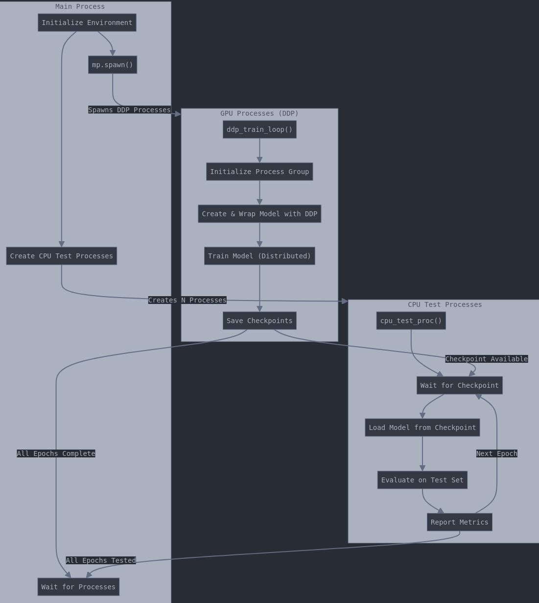
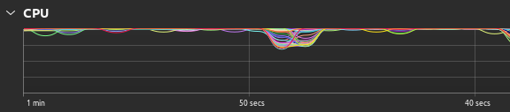
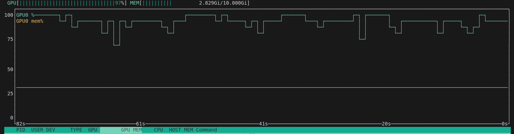
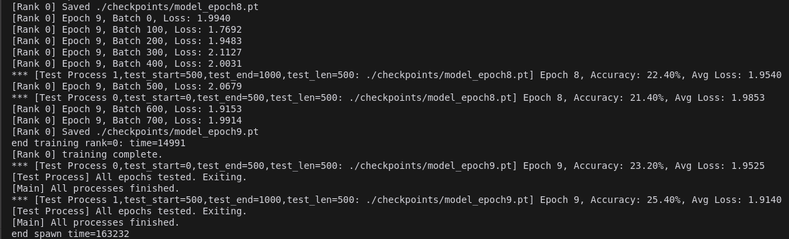

# Deep Learning Training with DDP and CPU Offloading

This project demonstrates distributed data parallel (DDP) training with CPU offloading for efficient deep learning model training.


## Features
- Distributed training using PyTorch DDP
- CPU offloading for evaluation/testing
- Hogwild-style parallel processing
- Optimized resource utilization

## Setup Instructions

### Environment Setup
```bash
# Create virtual environment
uv venv --python 3.11 uv311

# Activate environment
source uv311/bin/activate

# Install dependencies
uv pip install transformers torch torchaudio diffusers torchvision
```

### Running the Training
```bash
# Run with single GPU
CUDA_VISIBLE_DEVICES=0 torchrun --nproc-per-node=1 --standalone ddp.py
```


## CPU Offloading Implementation

The implementation uses Hogwild-style training where parallel model training occurs on N processes, with each process handling 1/N of the training data.

### Key Components
- **DDP Training**: Distributed data parallel training across GPU processes
- **CPU Offloading**: Test/evaluation processes run on CPU
- **Resource Optimization**: Maximizes both GPU and CPU utilization


### Reference Implementations
For more information on Hogwild training, see these examples:
- [This is Hogwild](https://towardsdatascience.com/this-is-hogwild-7cc80cd9b944)
- [Hogwild Implementation](https://github.com/wenig/hogwild/blob/master/index.py)
- [PyTorch MNIST Hogwild Example](https://github.com/pytorch/examples/blob/main/mnist_hogwild/main.py)

## Implementation Details

The `ddp.py` script implements parallel PyTorch model training using Hogwild principles while offloading the test process to CPU. This is a modified version of the traditional Hogwild implementation that creates additional CPU processes for each DDP torchrun process.

### Performance
The implementation achieves:
- Maximum GPU utilization for model training
- Maximum CPU usage for test processes
- Reduced training time through parallel processing

Notice ddp.py maxes out GPU usage with model training and CPU usage with test process.

## Algorithm

This code demonstrates an elegant architecture for distributed training with PyTorch that leverages both GPU and CPU resources efficiently. The implementation combines PyTorch's Distributed Data Parallel (DDP) with Python's multiprocessing to create a hybrid computational environment where GPU processes handle model training through torchrun while CPU processes simultaneously manage model evaluation. This offloading strategy optimizes resource utilization by running training on CUDA-enabled devices with efficient inter-GPU communication via NCCL backend, while parallel CPU processes asynchronously load the latest checkpoints to evaluate model performance on test data. The architecture incorporates a coordination mechanism where CPU test processes wait for checkpoints produced by the DDP training loop, enabling continuous evaluation without blocking the training pipeline, which is particularly valuable for large-scale deep learning workloads where separating compute-intensive training from evaluation can significantly improve throughput and hardware utilization.
The diagram above illustrates how the system architecture divides responsibilities between GPU and CPU processes, showing the flow of execution and data between different components. The main process orchestrates everything by spawning both the DDP training processes and the CPU evaluation processes, which then operate independently while coordinating through the checkpoint files.

## Architecture Diagram



## Usage

```bash
CUDA_VISIBLE_DEVICES=0 torchrun --nproc-per-node=1 --standalone ddp.py
```

## Notes

- CPU maxing out: CPU evaluation processes are spawned by the main process.



- GPU maxing out: DDP training processes are spawned by the main process.



- The DDP training processes and the CPU evaluation processes coordinate through the checkpoint files.


