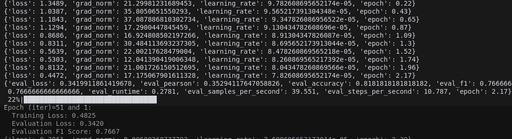
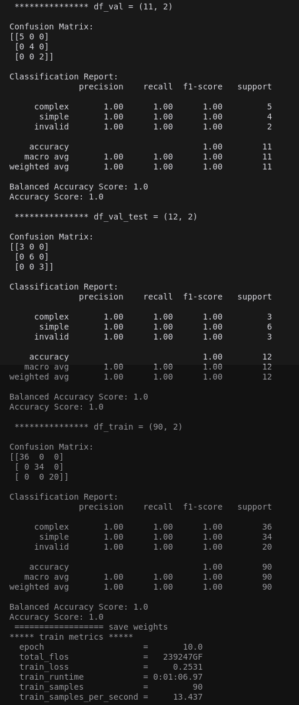
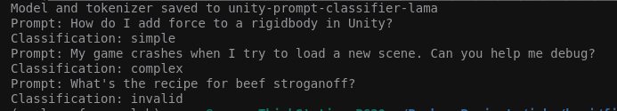
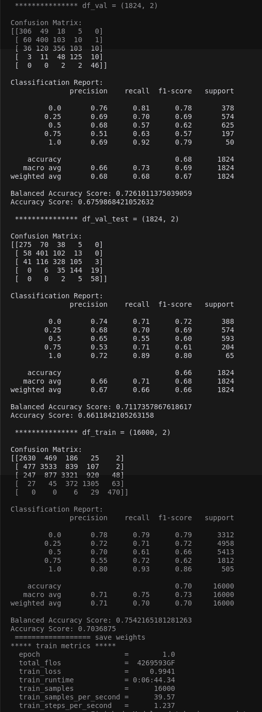

# Fine-tuning for Text Classification

## Instructions

### Classify text with fine-tuned model

```bash
python3 train.py 
python3 inference.py 
```

### Classify text with causal language model
```bash
python3 unity_train.py 
python3 unity_inference.py 
```

## Approaches

### 1. Text Generation with Classification Label
The model generates text that includes the classification label as part of the output.

### 2. Sequence Classification Head
Uses a sequence classification head (linear layer) on top of the LLaMa Model transformer, similar to GPT-2.
- **Training Objective**: Minimize cross-entropy loss between predicted and actual labels.

## Environment Setup

```bash
# Create and activate virtual environment
uv venv --python 3.11 uv_lora
source uv_lora/bin/activate

# Install dependencies from requirements file
uv pip install -r requirements_pip3.txt 

# Alternative: Manual installation
uv pip install "torch==2.2.2" tensorboard
uv pip install --upgrade "transformers==4.40.0" "datasets==2.18.0" "accelerate==0.29.3" "evaluate==0.4.1" "bitsandbytes==0.43.1" "huggingface_hub==0.22.2" "trl==0.8.6" "peft==0.10.0" "numpy==1.26.4" "pandas==2.2.2" "scikit-learn==1.6.1"
uv pip install --force-reinstall -v "triton==3.1.0"
```

## Implementation Details

### Dataset
- 100 synthetic examples generated from 15 real examples using class definitions
- Split into training, evaluation, and test sets

### Models
- Implemented both classification and causal language models
- Tested four foundational models (Google, Meta, Mistral, Microsoft) with equivalent accuracy
- Uses cross-entropy loss for classification

### Hardware Requirements
- GPU with 12GB VRAM or more (e.g., NVIDIA L4 or better)

## Results

### Classification Performance
- Achieved 100% accuracy after 10 epochs on a 3-class problem
- High accuracy across training, evaluation, and test datasets
- Note: Small dataset (100 samples) may cause variance

### Causal Language Model
Successfully completed prompt sentences after 10 epochs of training

## Parameter Efficient Fine-Tuning (PEFT)

### Overview
- Uses LoRA (Low-Rank Adaptation) for efficient fine-tuning
- Modifies only a subset of parameters, reducing memory and computational requirements

### QLoRA Enhancements
- 4-bit quantization using NormalFloat (NF4)
- 16-bit precision for low-rank adapters
- Double quantization for memory optimization
- Efficient memory management with paged optimizers

### Mathematical Foundation
For weight matrix $W$, LoRA uses the approximation:
$W = W_0 + BA$
where $W_0$ is the original weight matrix, and $BA$ represents the low-rank modification.

## References

https://arxiv.org/abs/2305.14314

https://github.com/adidror005/youtube-videos/blob/main/LLAMA_3_Fine_Tuning_for_Sequence_Classification_Actual_Video.ipynb

https://colab.research.google.com/github/jkyamog/ml-experiments/blob/main/fine-tuning-qlora/LLAMA_3_Fine_Tuning_for_Sequence_Classification.ipynb#scrollTo=IqufrL0vwDod

https://colab.research.google.com/github/jkyamog/ml-experiments/blob/main/fine-tuning-qlora/LLAMA_3_Fine_Tuning_for_Sequence_Classification.ipynb

## Demo screenshots: small 100 examples dataset

### Classification: 1st epoch



**Dataset is very small (100 samples) and reveals initial variance .**

### Classification: 100% accuracy after 10 epochs



**High accuracy for 3-class confusion matrix for training, evaluation, and test (unseen during trainig) datasets.**

### Causal Language Model: prompt sentence completion



**10 epochs.**

## Demo screenshots: large 37K examples "kaggle us patent phrase matching" dataset

### Classification 3 epochs



**High accuracy 5-class confusion matrix for training, evaluation, and test (unseen during trainig) datasets.**

### Requirements
* A GPU with 12GB VRAM or more.  Nvidia/L4 orbetter would work

## More information 

1. **Data Generation**: 100 data examples are synthetically generated from actual 15 examples and usingf the class definitons iun a sigle prompt. 


2. **Model Implementation**: classification and causal models that can determine if a prompt is simple or complex with fine-tuning

3. **Evaluation**: Classification custom model uses cross-entropy loss. 

4. **Technical design**: here is a high-level overview of the implementation of causal and classification models with fine-tuning and
trying four different foundational models (google, meta, mistral, misrosoft) that all produce equivalent accuracies.  Potential improvements include using smarter data generation, and training on CPU since the data is very small. 

### synthetic dataset: unity_data.py 

### Evaluation methodology: 

Splitting into train, eval, and test datasets and using a 3-class confusion matrix.

## More information about design - or - Big Picture Overview of Parameter Efficient Fine Tuning Methods like LoRA Fine Tuning for Sequence Classification

**Fine-tuning**
- LLMs are pre-trained on vast amounts of data for broad language understanding.
- Fine-tuning is crucial for specializing in specific domains or tasks, involving adjustments with smaller, relevant datasets.

**PEFT**
- PEFT modifies only a subset of the LLM's parameters, enhancing speed and reducing memory demands, making it suitable for less powerful devices.

**LoRA: Efficiency through Adapters**
- **Low-Rank Adaptation (LoRA):** Injects small trainable adapters into the pre-trained model.
- **Equation:** For a weight matrix $W$, LoRA approximates $W = W_0 + BA$, where $W_0$ is the original weight matrix, and $BA$ represents the low-rank modification through trainable matrices $B$ and $A$.
- Adapters learn task nuances while keeping the majority of the LLM unchanged, minimizing overhead.

**QLoRA: Compression and Speed**
- **Quantized LoRA (QLoRA):** Extends LoRA by quantizing the model's weights, further reducing size and enhancing speed.
- **Innovations in QLoRA:**
  1. **4-bit Quantization:** Uses a 4-bit data type, NormalFloat (NF4), for optimal weight quantization, drastically reducing memory usage.
  2. **Low-Rank Adapters:** Fine-tuned with 16-bit precision to effectively capture task-specific nuances.
  3. **Double Quantization:** Reduces quantization constants from 32-bit to 8-bit, saving additional memory without accuracy loss.
  4. **Paged Optimizers:** Manages memory efficiently during training, optimizing for large tasks.

**Why PEFT Matters**
- **Rapid Learning:** Speeds up model adaptation.
- **Smaller Footprint:** Eases deployment with reduced model size.
- **Edge-Friendly:** Fits better on devices with limited resources, enhancing accessibility.

**Conclusion**
- PEFT methods like LoRA and QLoRA revolutionize LLM fine-tuning by focusing on efficiency, facilitating faster adaptability, smaller models, and broader device compatibility.


