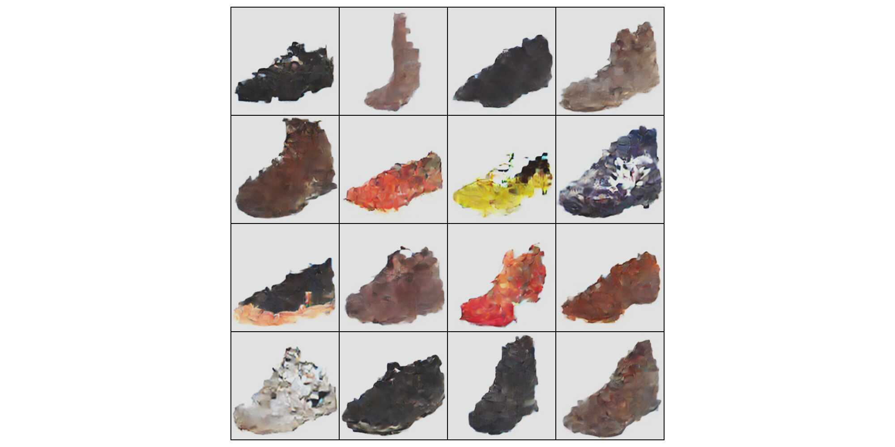

# Multimodal Conditioning Part-2: Text-Conditioning in Diffusion Transformer Models (DiT)

In this post I am going to show how DiT resolves the problems of text conditioning in GANs which I have shown in my previous post [Multimodal Conditioning Part-1: Enhancing GAN with Text-Conditioning](https://medium.com/@roman-kazinnik/multimodal-conditioning-part-1-enhancing-gan-with-text-conditioning-7e556a95c78d).
Here is the summary of the major drawbacks of text conditioning in GANs and how DiT solves them:

## Summary

| **cGAN Disadvantages**                                                                                 | **DiT Solution**                                                                                                    |
|--------------------------------------------------------------------------------------------------------|---------------------------------------------------------------------------------------------------------------------|
| Architectural imbalance — text conditioning cannot influence all stages of image generation           | Cross-attention mechanisms at all transformer blocks enable deep integration of text throughout generation         |
| Limited text representation — fails to capture complex semantics between text tokens and image patches | Transformer-based text encoders with cross-attention improve semantic alignment                                    |
| Limited conditioning control — projecting text to fixed-size vector loses fine-grained influence       | Removes classifier guidance, improving conditioning strength and flexibility                                       |
| Late feature integration — text features are added after image features are fully processed            | Early integration via cross-attention at each transformer block                                                    |
| Spatial uniformity — discriminator cannot focus on image regions tied to specific words                | Cross-attention aligns text tokens with corresponding image patches spatially                                     |
| Dimensionality imbalance — text features have equal weight to whole image features, distorting balance | Text tokens and image patches are projected to the same dimensional space                                          |
| Limited text-image correlation learning — poor alignment between concepts and visuals                  | Cross-attention supports fine-grained text-image correlation                                                       |
| Fixed patch size limitation — lacks flexibility in aligning varying text concepts with image parts     | Cross-attention handles flexible mapping between text tokens and image patches                                     |
| Feature collapse — discriminator over-relies on either text or image features                          | Classifier-free guidance (CFG) with dual predictions balances conditional and unconditional generation             |
| Lack of multi-scale text conditioning — conditioning occurs only at the final layer                    | Cross-attention applied across all transformer blocks for multi-scale text conditioning                            |

## Experiments

Github: my work can be found in my [DiT-Text-Conditioning](https://github.com/romankazinnik/romankazinnik_blog/tree/master/genai/dit) repository.
DiT: I used the original DiT code from the [Diffusion Transformer Luke Ditria](https://github.com/LukeDitriar) repository.

### Figure Architecture: Text-Conditioning in DiT

<figure>
  
  <figcaption>DiT with Text Conditioning Architecture (This Model Has approximately 95 Million Parameters)</figcaption>
</figure>


Training and inference results:

<figure>
  
  <figcaption>Training results after 9 epochs</figcaption>
</figure>

<figure>
  
  <figcaption>Training results after 84 epochs</figcaption>
</figure>

## Multi-modal conditioning

### 111 epochs: mode collapse effect
<!--     <figure style="display: flex; gap: 10px;"> -->
<figure style="display: flex; flex-direction: column;">
  <br>
  
    <figcaption>Identical image VAE samples conditioned with different texts, after 111 epochs. Notice an interesting effect of mode-colapse in 
    op row third column: changing text "Black, sneaker, unisex" to "Red, sneaker, unisex" resulted in generating as a tottaly different shoe. 
    </figcaption>
</figure>

### 136 epochs

<figure style="display: flex; flex-direction: column;">
  <br>
  
    <figcaption>Identical image VAE samples conditioned with different texts, after 136 epochs. Notice an interesting effect of mode-colapse in 
    op row third column: changing text "Black, sneaker, unisex" to "Red, sneaker, unisex" resulted in generating as a tottaly different shoe. 
    </figcaption>
</figure>

### Figure Architecture: Edges and Text-Conditioning in DiT

Now I am adding edges to the text conditioning in DiT and compare the results with the original GAN pix2pix image generation.
<figure>
  
  <figcaption>DiT with Edge and Text Conditioning Architecture (This Model Has approximately 104 Million Parameters)</figcaption>
</figure>


## Reproduce

```bash
uv pip install -r requirements_pip_freeze.txt

# test
python3 dit_dataset.py

# run
python3 dit_run.py
```

Image and text emebdding dataset:

```bash

TBD


```


