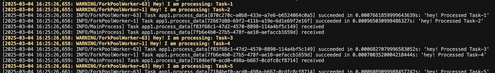
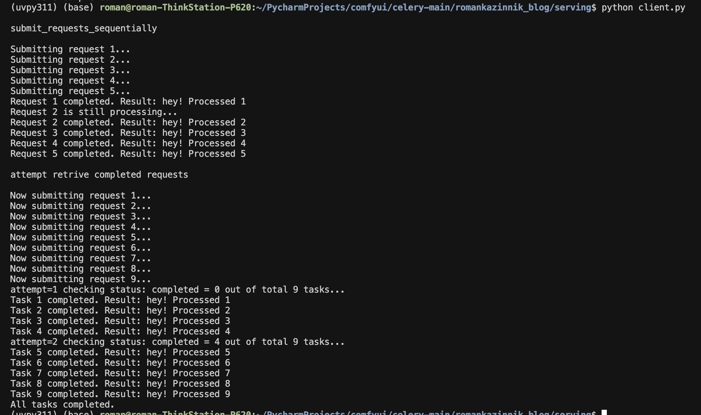

# Celery Sequential Task Processing 101 Example

This example demonstrates how to use Celery with Redis as the message broker to submit tasks sequentially, check for their completion, and retrieve results within a given time frame.

## Project Structure

- `app.py`: Contains the Celery app configuration and the `process_data` task.
- `client.py`: Submits tasks sequentially and checks for their completion within 5 seconds.
  
## Prerequisites

1. Install the required dependencies.

2. Ensure that Redis is installed and running locally as it will be used as the message broker.

3. Celery app configuration (app.py):

The Celery app is configured to use Redis as the message broker.
A process_data task simulates a data processing task that sleeps for 2 seconds before completing.


4. Client application (client.py):

The client submits five tasks sequentially with a 1-second delay between each.
After submitting each task, the script waits for the task to complete (or checks every 0.5 seconds for up to 5 seconds).
If a task is completed within 5 seconds, its result is retrieved using result.get().
If the task is not completed within 5 seconds, a message is displayed indicating the task did not complete in time.

The Celery worker processes tasks as they are submitted and prints messages when tasks are being processed.

5. Instructions

```bash
sudo apt install redis-server
uv venv --python 3.11 uvpy311
source uvpy311/bin/activate
uv pip install celery redis
redis-server 
redis-cli
uv run celery -A app worker --loglevel=info
python client.py
```

5. Results:




