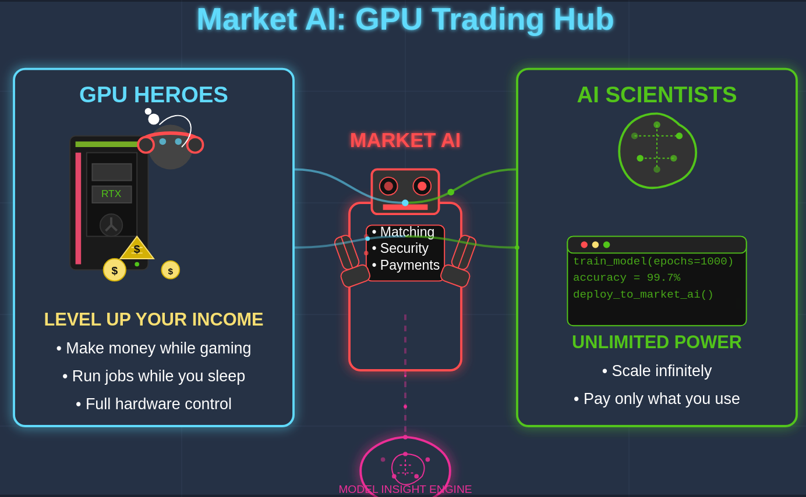
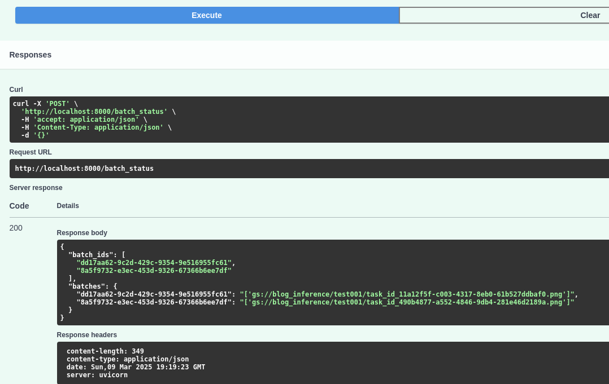

# Market AI: Democratizing GPU Access

## Short Description

### Market AI diagram



**Market AI connects GPU owners with AI developers to maximize resource utilization and reduce costs.**

Market AI is a peer-to-peer platform that connects GPU owners with AI developers to maximize resource utilization and reduce costs. By allowing GPU owners to monetize their idle computing power and providing AI developers with affordable access to computational resources, Market AI creates a democratized marketplace for AI development. The platform handles subscriptions, resource allocation, security, and payment processing, while optionally collecting input/output data for model improvement and fine-tuning.


**text2image.**

## Instructions

## Install dependencies

```bash
uv venv --python 3.11 uvmq

source uvmq/bin/activate
# Install FastAPI message queue dependencies
uv pip install -r requirements.txt
# install API dependencies
uv pip install transformers torch huggingface-hub diffusers accelerate google-cloud-storage google
uv pip install requests
sudo apt install redis-server

systemctl --user start docker-desktop

sudo apt-get install docker-compose-plugin
```

### Install docker-compose
```bash
docker compose version

sudo curl -SL https://github.com/docker/compose/releases/download/v2.33.1/docker-compose-linux-x86_64 -o /usr/local/bin/docker-compose

sudo chmod +x /usr/local/bin/docker-compose

docker-compose

The FastAPI server is running on port 8000 localhost:8000/docs has complete description of endpoints with example requests and responses
```

### Alternatively install redis

```bash
sudo snap install redis

sudo apt install redis-tools

redis-server

redis-cli

Google storage API

./google-cloud-sdk/bin/gcloud init

./google-cloud-sdk/bin/gcloud auth application-default login
```

## Development
```bash
cd serving
# Local api ('rider', AI developer)
uv run uvicorn api_local.api_rider:app --host 0.0.0.0 --port 8001 --reload

# Remote api ('driver', GPU owner)
uv run uvicorn api.api:app --host 0.0.0.0 --port 8000 --reload

# Remote worker ('driver', GPU owner)
uv run celery -A worker.worker worker --loglevel=info --concurrency=1000 --pool=gevent
```
## Production
```bash
uv run gunicorn api.api:app -w 4 -k uvicorn.workers.UvicornWorker -b 0.0.0.0:8000
```
## Documentation
```bash
http://localhost:8000/docs#/default/process_urls_process_post
```
### Remote
```bash
http://192.168.7.230:8000/docs
```

### Local ('rider'): submit API/GPU jobs to remote server
```bash


mkdir /tmp/test001 # download files from gcs

http://localhost:8001/uber_rider

uv run celery -A worker.worker_rider worker --loglevel=info --concurrency=1000 --pool=gevent
```

### Google cloud 
```bash
gcloud auth application-default login

sudo apt-get install -y google-cloud-sdk

uv pip install google-cloud-storage google

gsutil ls gs://blog_inference
```

## Demo screenshots

### GPU server ('driver')



**Fast API returns list of batch ids and their statuses with gcs file links.**

### Local api ('rider')


**Fast API recieves gcs links from remote API server and downloads them to local storage.**

