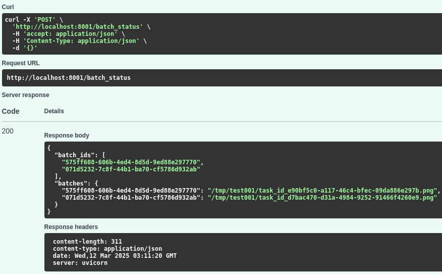

# Instructions

## Install dependencies

```bash
uv venv --python 3.11 uvmq

uv pip install -r requirements.txt

sudo apt install redis-server

systemctl --user start docker-desktop

sudo apt-get install docker-compose-plugin
```

### Install docker-compose
```bash
docker compose version

sudo curl -SL https://github.com/docker/compose/releases/download/v2.33.1/docker-compose-linux-x86_64 -o /usr/local/bin/docker-compose

sudo chmod +x /usr/local/bin/docker-compose

docker-compose

The FastAPI server is running on port 8000 localhost:8000/docs has complete description of endpoints with example requests and responses
```

### Alternatively install redis

```bash
sudo snap install redis

sudo apt install redis-tools

redis-server

redis-cli
```

## Development
```bash
uv run uvicorn api.api:app --host 0.0.0.0 --port 8000 --reload

uv run celery -A worker.worker worker --loglevel=info --concurrency=1000 --pool=gevent
```
## Production
```bash
uv run gunicorn api.api:app -w 4 -k uvicorn.workers.UvicornWorker -b 0.0.0.0:8000
```
## Documentation
```bash
http://localhost:8000/docs#/default/process_urls_process_post
```
### Remote
```bash
http://192.168.7.230:8000/docs
```

### Local ('rider'): submit API/GPU jobs to remote server
```bash
http://localhost:8001/uber_rider

uv run celery -A worker.worker_rider worker --loglevel=info --concurrency=1000 --pool=gevent
```

### Google cloud 
```bash
gcloud auth application-default login

sudo apt-get install -y google-cloud-sdk

uv pip install google-cloud-storage google

gsutil ls gs://blog_inference
```

## Demo screenshots

### GPU server ('driver')


**Fast API returns list of batch ids and their statuses with gcs file links.**

### Local api ('rider')



**Celery worker returns statuses of all the tasks in the batch.**

