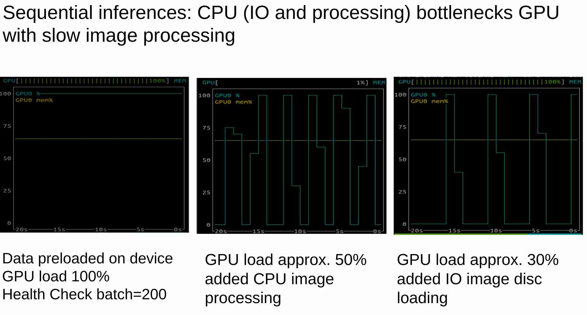

# Maximizing Inference API Throughput: Lessons from the Trenches

## TL;DR
Built a high-performance inference API by benchmarking anlysis and identifying and addressing system bottlenecks and scaling the CPU processing. 

## Introduction

In the world of machine learning deployment, serving models efficiently at scale is often as challenging as training them. This post shares key insights from my building a high-throughput inference API prototype designed to maximize system resource utilization.


## The Inference Performance Puzzle

My goal was straightforward but ambitious: create an API that pushes maximum possible throughput by fully utilizing allavailable resources, whether CPU cores or GPUs—whichever hits their limit first.

An interesting but expected discovery emerged: while GPUs could process batches of 200 images nearly as fast as a single image, this theoretical advantage wasn't materializing in practice. 


### Performance Analysis

My first task was benchmarking the sequential inference pipeline. I measured latencies across key components:

**Table 1: Component Latencies**
- Image disk I/O
- CPU image processing
- GPU single inference
- GPU batched inference

[comment]:    

  

Ptorch profiler results are identical to the above results: 10ms cpu latency and 2.7 ms GPU latency per image.


### The Bottleneck 

**Figure 1** revealed the culprit: CPU-bound image loading and processing was throttling GPU performance. This created an unexpected outcome—batching, which is considered essential for training efficiency, provided only minimal speedup for inference.



**Table 2** confirmed this finding, showing actual observed latencies closely matching theoretical expectations based on:


```
total latency = API latency/number of workers + max(GPU latency/number of GPUs, CPU latency/number of workers)
```


## Model Infrence API with FastAPI with Task Brokering

Based on these insights, I developed an inference API built on FastAPI with Redis and Celery as the task broker. This architecture:

1. Delivers millisecond-level latency
2. Achieves over 100 requests per second (7.93 ms latency)
3. Scales linearly with additional workers (**Figure 2**) up to the maximum number of available cores


## Future Optimization Paths

With the current bottleneck identified, two clear optimization strategies emerge:

1. **Scale the CPU processing** (simpler):
   - Add more nodes/cores
   - Requires no architectural changes
   
2. **Offload to GPU** (more complex):
   - Move CPU-bound image processing to the GPU
   - Add more GPUs to handle the increased workload
   - Requires code refactoring

## Conclusion

Sometimes the simplest solutions are the most elegant. By identifying that CPU processing was the actual bottleneck—not GPU inference—I was able to build a streamlined, high-performing inference API without overengineering. The system not only performs exceptionally well but offers a clear, data-driven path for future scaling. Remember: measure first, optimize second!

## The Power of Analytical Validation

One of the most valuable aspects of this project was the close alignment between analytical predictions and observed performance. When your system's real-world behavior matches your theoretical model, it provides strong evidence that your implementation is nearly optimal and likely bug-free. This analytical validation approach saved countless hours that might have been spent hunting phantom performance issues or implementing unnecessary optimizations, and focus optimization efforts precisely where they would have the greatest impact.

## References 

[1] https://roman-kazinnik.medium.com/market-ai-democratizing-gpu-and-model-access-41cb3dbf1052

[2] https://github.com/romankazinnik/romankazinnik_blog/tree/master/serving

[3] https://github.com/romankazinnik/romankazinnik_blog/tree/master/serving_gpu

### Inference API architecture:


### Source: https://derlin.github.io/introduction-to-fastapi-and-celery/03-celery/


## Run Inference API

```
cd serving

# fastapi      
uv run uvicorn api.api:app --host 0.0.0.0 --port 8000 --reload

# celery taks brokers
# 3x workers

uv run celery -A worker.worker_embed  worker --loglevel=error --concurrency=1000 --pool=gevent --autoscale=200,300

uv run celery -A worker.worker_embed  worker --loglevel=error --concurrency=1000 --pool=gevent --autoscale=200,300

uv run celery -A worker.worker_embed  worker --loglevel=error --concurrency=1000 --pool=gevent --autoscale=200,300

# 1000 requests

python3 stress_api.py 10 100

2025-04-04 10:31:38,961 - __main__ - INFO - done=10 (10) num_tasks_done=1000
2025-04-04 10:31:38,961 - __main__ - INFO - done=10 throughput=123.53 image/sec latency=8.10 ms

```

## Pytorch Profiler Experiments

Run sequential benchmark test instructions. 

- Single GPU inference latency for batch size=200 vs batch size=1 is very fast (here 200:1), as expected. 

- Batch inference speedup nearly canceled out by CPU-GPU data transfer and CPU processing (CPU processing: 97.97%) bottlenecked on CPU.

- Single inference is slow but shows even CPU-GPU load does not bottleneck inferences on CPU and scales up linearly.

```
# batch size 200

> python3 embed_sequence.py 5 200

===== PERFORMANCE STATISTICS =====
Total images processed: 1000
Total processing time: 8.52 seconds
Throughput: 117.31 images/second

----- Per Image Statistics -----
Disk I/O time: 0.04 ms/image
CPU processing time: 8.35 ms/image
GPU transfer time: 2.51 ms/image
GPU inference time: 0.02 ms/image
Result writing time: 0.11 ms/image

----- Pipeline Breakdown -----
Disk I/O: 0.45%
CPU processing: 97.97%
GPU transfer: 29.45%
GPU inference: 0.28%
Result writing: 1.30%
=================================
```

```
# batch size 1

> python3 embed_sequence.py 40 1 

===== PERFORMANCE STATISTICS =====
Total images processed: 40
Total processing time: 0.55 seconds
Throughput: 72.92 images/second

----- Per Image Statistics -----
Disk I/O time: 0.08 ms/image
CPU processing time: 8.34 ms/image
GPU transfer time: 0.41 ms/image
GPU inference time: 5.09 ms/image
Result writing time: 0.21 ms/image

----- Pipeline Breakdown -----
Disk I/O: 0.56%
CPU processing: 60.79%
GPU transfer: 2.98%
GPU inference: 37.11%
Result writing: 1.54%
```
